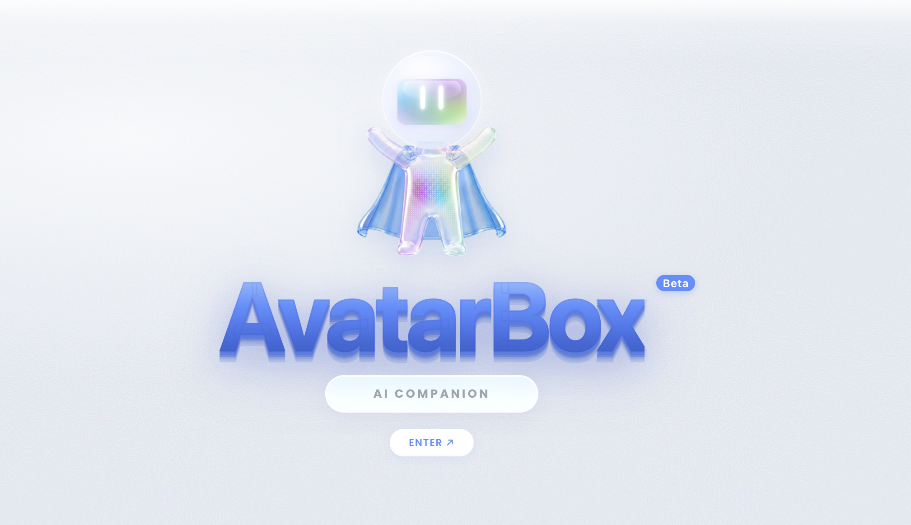
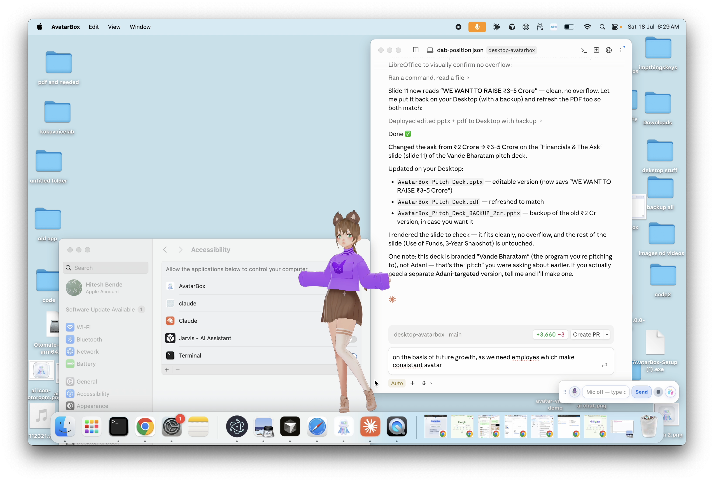

### Your desktop comes alive — a 3D talking avatar companion that lives on your screen.

**Chat by voice or text. Pick from 100+ anime & stylized avatars. Give them a personality, a voice, and a home on your desktop.**

[**⬇️ Download for Mac →**](https://pub-6759236445b44e818421ce57181069b6.r2.dev/AvatarBox.dmg)  ·  [All Releases](../../releases)  ·  [Website](https://avatarbox.app)  ·  [Report an issue](../../issues)

---

**⭐ If AvatarBox made you smile, hit the Star button — it helps others discover it!**

---

> **Note:** This is the public home of AvatarBox. The app itself is a polished, closed-source product — grab it from **[avatarbox.app](https://avatarbox.app)**. This repository is for the story, the screenshots, and your feedback.

---

## ✨ What is AvatarBox?

AvatarBox puts a real, animated **3D character on your desktop** — one you can actually talk to. It listens, replies out loud in a natural voice, reacts with expressions and gestures, and can even perch on the edge of your windows while you work.

It's not just a companion — it can control your desktop, automate your browser, message on WhatsApp, generate images, and narrate your coding sessions live alongside Claude, Cursor, and VS Code.

Think of it as a companion, an assistant, and a little bit of magic — all in one small floating window.

## 🌟 Highlights

- 🎭 **100+ avatars** — anime, stylized and original 3D characters (VRM & GLB), each with video previews.
- 🗣️ **Real voice chat** — talk to it hands-free; it replies out loud with lip-sync and emotion.
- 🌍 **31 languages** — chat and speak in English, Hindi, Japanese, Spanish, and many more.
- 💖 **Personalities** — pick a companion, a witty buddy, a calm assistant, and more.
- 🎙️ **Custom voices** — a growing library of natural TTS voices, including your own cloned voice.
- 🪟 **Perch mode** — let your avatar sit on the edge of your windows and hang out while you work.
- 🖥️ **Desktop control** — open apps, adjust volume, lock screen, empty trash — all by voice or chat.
- 🌐 **Browser automation** — the avatar can control and interact with your browser on your behalf.
- 💬 **WhatsApp messaging** — send and receive WhatsApp messages through your avatar.
- 🎨 **AI image generation** — generate images right from the chat window.
- 🧑‍💻 **Coding narrator** — live voice companion while you code in VS Code, Cursor, or Claude Code.
- 🎵 **WorkBox** — built-in focus mode with music player and YouTube to keep you in flow.
- ✨ **Beautiful, glassy UI** — a soft, modern glassmorphic design with themes.
- 🎬 **FunStudio & Prompter** — create, share, and explore in a built-in community space.
- 🔒 **Private by design** — offline text-to-speech built in; your chats stay yours.

## 🚀 Get AvatarBox

| Platform | |
|---|---|
| 🍎 **macOS** (Apple Silicon, notarized) | [**Download →**](https://pub-6759236445b44e818421ce57181069b6.r2.dev/AvatarBox.dmg) |
| 🪟 **Windows** | Coming soon |

> See all versions on the [**Releases page →**](../../releases)

## 💬 Feedback & ideas

Found a bug or have a feature idea? [**Open an issue**](../../issues) — we read everything.

## 📫 Contact

- 🌐 Website: [avatarbox.app](https://avatarbox.app)
- 📧 Support: supportcodekins@gmail.com

---

**AvatarBox** is built with ❤️ by **[Codekins](https://avatarbox.app)**.

© Codekins. All rights reserved. See [LICENSE](LICENSE).

