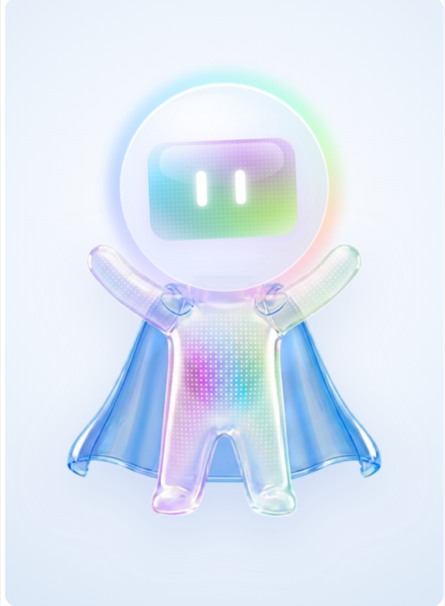
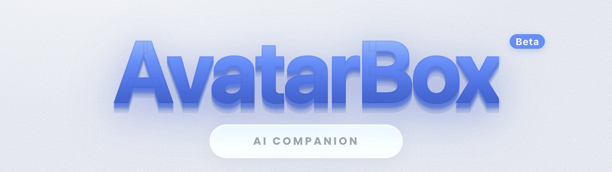

### Your desktop comes alive — a 3D talking avatar companion that lives on your screen.

**Chat by voice or text. Pick from 100+ anime & stylized avatars. Give them a personality, a voice, and a home on your desktop.**

[**⬇️ Download for Mac & Windows →**](https://avatarbox.app)  ·  [Website](https://avatarbox.app)  ·  [Report an issue](../../issues)

---

> **Note:** This is the public home of AvatarBox. The app itself is a polished, closed-source product — grab it from **[avatarbox.app](https://avatarbox.app)**. This repository is for the story, the screenshots, and your feedback. ⭐ Star it if you like what you see!

---

## ✨ What is AvatarBox?

AvatarBox puts a real, animated **3D character on your desktop** — one you can actually talk to. It listens, replies out loud in a natural voice, reacts with expressions and gestures, and can even perch on the edge of your windows while you work.

Think of it as a companion, an assistant, and a little bit of magic — all in one small floating window.

## 🌟 Highlights

- 🎭 **100+ avatars** — anime, stylized and original 3D characters (VRM & GLB), each with video previews.
- 🗣️ **Real voice chat** — talk to it hands-free; it replies out loud with lip-sync and emotion.
- 🌍 **31 languages** — chat and speak in English, Hindi, Japanese, Spanish, and many more.
- 💖 **Personalities** — pick a companion, a witty buddy, a calm assistant, and more.
- 🎙️ **Custom voices** — a growing library of natural TTS voices, including your own cloned voice.
- 🪟 **Perch mode** — let your avatar sit on the edge of your windows and hang out while you work.
- 🎨 **Beautiful, glassy UI** — a soft, modern glassmorphic design with themes.
- 🎬 **FunStudio & Prompter** — create, share, and explore in a built-in community space.
- 🔒 **Private by design** — offline text-to-speech built in; your chats stay yours.

## 🚀 Get AvatarBox

The app is available as a signed, notarized download:

| Platform | |
|---|---|
| 🍎 **macOS** (Apple Silicon) | [Download →](https://avatarbox.app) |
| 🪟 **Windows** | [Download →](https://avatarbox.app) |

> Visit **[avatarbox.app](https://avatarbox.app)** for the latest version and install instructions.

## 💬 Feedback & ideas

Found a bug or have a feature idea? [**Open an issue**](../../issues) — we read everything.

## 📫 Contact

- 🌐 Website: [avatarbox.app](https://avatarbox.app)
- 📧 Support: supportcodekins@gmail.com

---

**AvatarBox** is built with ❤️ by **[Codekins](https://avatarbox.app)**.

© Codekins. All rights reserved. See [LICENSE](LICENSE).

